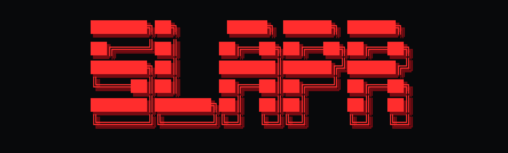

<p align="center">
  
</p>

# SLAPR

SLAPR is a crypto-native image generation terminal for turning PFPs, NFTs, token ideas, and short prompts into social-ready visuals. The product direction is simple: make the fastest creative cockpit for crypto teams and creators who need sharp, repeatable assets without leaving the browser.

The current alpha focuses on prompt-to-image and source-image remix workflows, with a terminal-style desktop UI, browser-session API key management, model status checks, and local fallback rendering when a remote provider is unavailable.

## Current Status

- Version: `0.1.2 alpha`
- Primary workflow: upload or prompt, choose a model, generate, then save as `png`, `jpg`, `webp`, or `svg`
- Desktop UI: full-width workspace with centered output frame and compact model status grid
- Local static server: `node out/server.mjs`
- Server API routes:
  - `/api/generate`
  - `/api/check-key`
- Current local static server generation support:
  - Grok / xAI `grok-imagine-image`
  - OpenAI GPT Image models
- Next server route support includes provider modules for OpenAI, Google, Stability, Hugging Face, xAI, BFL, Pollinations, and local mock generation.
- API keys are never committed. Users can provide keys through browser session/local storage for local testing, or through server environment variables for hosted deployments.

## Build In Public

SLAPR is built in public. This repo intentionally shows the authentic process: small increments, rough edges, task notes, verification fixes, and deployment lessons as they happen. The goal is for users and contributors to see steady daily work, not only polished drops after the fact.

## Vision

SLAPR should become the creative layer between crypto culture and production-grade media models:

- fast image generation for PFP remixes, launch posts, meme cards, stickers, and campaign visuals
- model-agnostic provider routing so teams can compare output quality and cost quickly
- strong character-lock workflows for NFT and avatar identity
- a nontechnical API setup path for creators who can paste keys but do not want to manage servers
- exportable assets that are immediately usable in social feeds and campaign decks

## Features

- PFP/NFT source image upload
- Prompt-first generation with a built-in GM PFP template
- Optional SLAPR prompt enhancement
- Aspect ratios: `1:1`, `16:9`, `9:16`, `21:9`
- Save formats: `png`, `jpg`, `webp`, `svg`
- Light, dark, and degen themes
- Model status grid showing local, connected, working, missing-key, and failed states
- Browser API key manager with session or local storage
- Same-origin API calls so provider keys are not embedded in client code
- Local mock generator for fallback previews
- Static `out` bundle for quick local serving

## Models And Providers

Current image model registry includes:

- SLAPR Character Lock
- SLAPR Remix Board
- Pollinations Flux
- Grok Imagine Image
- FLUX.2 Pro Preview
- FLUX.2 Pro
- FLUX.2 Klein 9B Preview
- FLUX.2 Klein 9B
- OpenAI GPT Image 2
- OpenAI GPT Image 1.5
- Google Nano Banana 2
- Google Nano Banana Pro
- Google Imagen 4
- Stability Core
- Stability Ultra
- Hugging Face Qwen Image
- Hugging Face Hyper-SD

## Local Development

Install dependencies:

```bash
npm install
```

Run the Next development server when active source editing is needed:

```bash
npm run dev
```

Run the current static/local API server:

```bash
npm start
```

Then open:

```text
http://127.0.0.1:3000
```

Build commands:

```bash
npm run build
npm run build:static
npm run typecheck
npm run lint
npm run test
npm run test:smoke
npm run check
```

`npm run build` creates the server-capable Next build. `npm run build:static` opts into `NEXT_STATIC_EXPORT=1` and writes the static `out` directory. `npm run check` runs typecheck, lint, and unit tests. The checked-in `out/server.mjs` is the local static/API preview server used for quick desktop testing.

Use Node `22.13.0` or another version allowed by `package.json` engines for the cleanest local install.

## Environment

Copy `.env.example` to `.env.local` for local server-side testing.

```bash
AI_PROVIDER=mock

OPENAI_API_KEY=
OPENAI_IMAGE_MODEL=gpt-image-2

XAI_API_KEY=
XAI_IMAGE_MODEL=grok-imagine-image

BFL_API_KEY=
BFL_IMAGE_MODEL=flux-2-pro-preview

GEMINI_API_KEY=
GOOGLE_API_KEY=
GOOGLE_IMAGE_MODEL=gemini-3.1-flash-image-preview

STABILITY_API_KEY=
STABILITY_IMAGE_MODEL=stable-image-core

HF_TOKEN=
HUGGINGFACE_API_KEY=
HUGGINGFACE_IMAGE_MODEL=Qwen/Qwen-Image

POLLINATIONS_API_KEY=
POLLINATIONS_IMAGE_MODEL=flux
POLLINATIONS_IMAGE_BASE_URL=https://image.pollinations.ai/prompt
```

Set `AI_PROVIDER=openai`, `xai`, `bfl`, `google`, `stability`, `huggingface`, or `pollinations` to choose a default server provider. Production deployments should use environment variables instead of client-side browser storage.

Official key pages used by the in-app guide:

- OpenAI: https://platform.openai.com/api-keys
- xAI: https://console.x.ai
- Black Forest Labs: https://dashboard.bfl.ai
- Google AI Studio: https://aistudio.google.com/app/apikey
- Stability AI: https://platform.stability.ai
- Hugging Face: https://huggingface.co/settings/tokens

## Security Notes

- Do not commit `.env`, `.env.local`, or provider API keys.
- `.env.example` contains empty placeholders only.
- Browser-stored keys are for local testing convenience.
- Hosted production should keep keys server-side.

## Deployment Notes

GitHub Pages can serve the static UI, but real provider image generation needs a server route so API keys stay private. Vercel is the intended server deployment target, but this repository can also run locally through `node out/server.mjs`.

No Vercel deploy is required for the current GitHub push.

## License

SLAPR is released under the MIT License.
