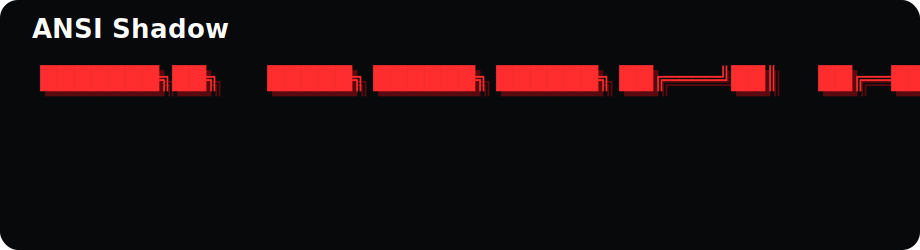

<p align="center">
  
</p>

# SLAPR

Crypto-native image and video prompt generation for viral social content.

SLAPR is an open-source alpha for turning crypto ideas into social-ready image concepts and video prompts. The current GitHub Pages build uses a static mock generator so anyone can try the interface without accounts, API keys, or a backend.

## Brand

- Primary color: SLAPR Red `#FF2D2D`
- Logo style: ANSI Shadow inspired ASCII wordmark

## MVP

- Prompt builder for token, narrative, tone, style, and output type
- Image generation flow with mock provider by default
- OpenAI image provider ready behind environment variables
- Video prompt generation mock for future model integration
- Copy and regenerate workflow
- Modular registries for models, providers, styles, tones, and templates

## Stable Preview Workflow

```bash
npm install
npm run build
npm run serve:static
```

Open `http://127.0.0.1:3000` only for local smoke tests. This serves the exported static `out` folder with Python and avoids Next's hot reload watcher.

For local editing, use the webpack dev server:

```bash
npm run dev
```

Avoid `npm run dev:turbo` on machines with flaky localhost or filesystem watcher issues.

## Vercel Workflow

Use Vercel Preview deployments as the default review surface instead of localhost previews. `vercel dev` still runs a localhost server, so it is not the recommended path for this machine.

1. Push a branch to GitHub.
2. Let Vercel create a Preview deployment URL for that branch or pull request.
3. Promote or merge to `main` for Production.
4. Add environment variables in Vercel Project Settings:
   - `AI_PROVIDER`
   - `OPENAI_API_KEY`
   - `OPENAI_IMAGE_MODEL`

The local `.env.local` file is only for local testing. Vercel Preview and Production should each have their own environment values.

## GitHub Pages

The current hosted MVP is built as a static site for GitHub Pages. It uses the browser-side mock generator so it can run without localhost, a server process, or exposed API keys.

The included GitHub Actions workflow deploys `main` to Pages from the `out` directory. Add `public/CNAME` with `slapr.ai` after DNS points at GitHub Pages.

Real OpenAI image generation should run through a server host such as Vercel, not GitHub Pages, because the API key must stay server-side.

## Open Source

SLAPR is released under the MIT License. Contributions are welcome through issues and pull requests.

## Environment

Copy `.env.example` to `.env.local`.

```bash
AI_PROVIDER=mock
OPENAI_API_KEY=
OPENAI_IMAGE_MODEL=gpt-image-1
```

Set `AI_PROVIDER=openai` and add `OPENAI_API_KEY` to use OpenAI image generation.
